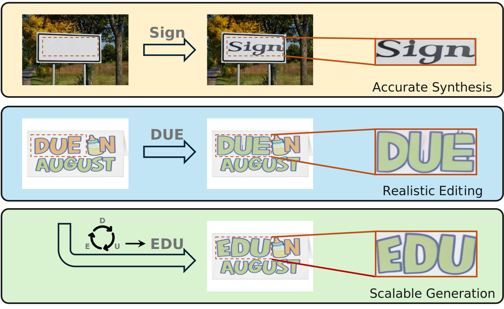
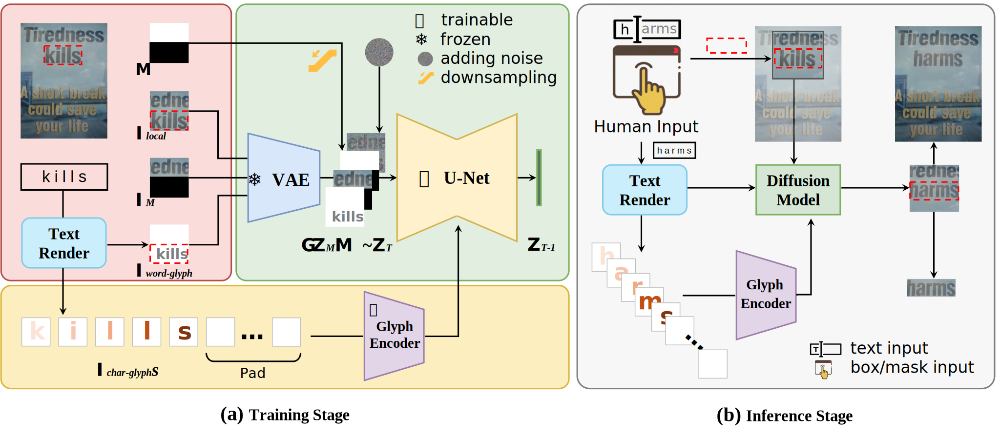
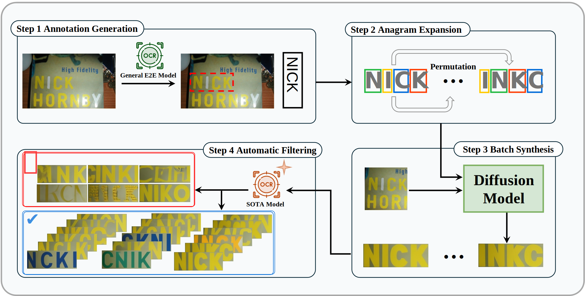
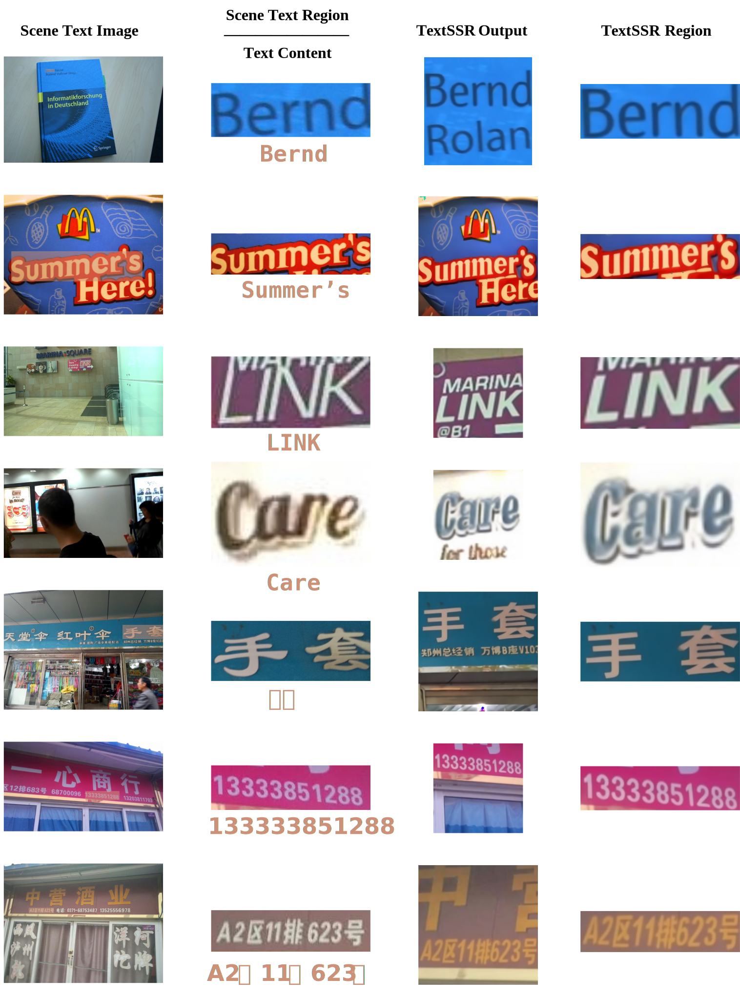

# 🎰TextSSR: Diffusion-based Data Synthesis for Scene Text Recognition

<a href='https://arxiv.org/abs/2412.01137'></a> <a href='https://textssr.github.io/'></a> <a href='https://www.modelscope.cn/studios/Yesianrohn/TextSSR'></a> <a href='https://www.modelscope.cn/models/Yesianrohn/TextSSR'></a> <a href='https://www.modelscope.cn/datasets/Yesianrohn/AnyWord-lmdb'></a> <a href='https://www.modelscope.cn/datasets/Yesianrohn/TextSSR-F'></a> 

<div style="text-align: left;">

</div>

$$
TextSSR ~ Capability ~ Showcase.
$$


## 📢News

[2025.06.26] - This paper has been accepted by ICCV2025 🎉!  

[2025.02.13] - The [benchmark and evaluation code](https://github.com/TextSSR/eval) are available!  

[2024.12.05] - The [training  dataset](https://www.modelscope.cn/datasets/Yesianrohn/AnyWord-lmdb) and generative dataset([v1: 0.43m](https://www.modelscope.cn/datasets/Yesianrohn/TextSSR-F) and [v2: 3.55m](https://www.modelscope.cn/datasets/Yesianrohn/TextSSR-F-v2.0)) are released!  

[2024.12.04] - We released the latest model and online demo, check on [ModelScope](https://www.modelscope.cn/models/Yesianrohn/TextSSR).

[2024.12.03] - Our paper is available at [here](https://arxiv.org/abs/2412.01137).


## 📝TODOs
- [ ] Upload the new revised version of the manuscript
- [x] Release the expanded large-scale synthetic dataset TextSSR-F, which contains 3.55M text instances.
- [x] Provide publicly checkpoints and gradio demo
- [x] Release TextSSR-benchmark dataset and evaluation code
- [x] Release processed AnyWord-lmdb dataset 
- [x] Release our scene text synthesis dataset, TextSSR-F
- [x] Release training and inference code


## 💎Visualization

<div style="text-align: left;">

</div>

$$
Model  ~ Architecture ~ Display.
$$

<div style="text-align: left;">

</div>

$$
Data  ~ Synthesis ~ Pipeline.
$$

<div style="text-align: left;">

</div>


$$
Results ~ Presentation.
$$


## 🛠Installation

#### Environment Settings

1. **Clone the TextSSR Repository:**
   
    ```bash
    git clone https://github.com/YesianRohn/TextSSR.git
    cd TextSSR
   ```

2. **Create a New Environment for TextSSR:**
   ```bash
   conda create -n textssr python=3.10
   conda activate textssr
   ```

3. **Install Required Dependencies:**
   
   - Install PyTorch, TorchVision, Torchaudio, and the necessary CUDA version:
   ```bash
   conda install pytorch==2.1.0 torchvision==0.16.0 torchaudio==2.1.0 pytorch-cuda=11.8 -c pytorch -c nvidia
   ```
   
   - Install the rest of the dependencies listed in the `requirements.txt` file:
   ```bash
   pip install -r requirements.txt
   ```
   - Install our modified diffusers:
   ```bash
   cd diffusers
   pip install -e .
   cd ..
   ```

---

#### Checkpoints/Data Preparation


1. **Data Preparation:**

   - You can use the [`Anyword-3M`](https://www.modelscope.cn/datasets/iic/AnyWord-3M) dataset provided by Anytext. However, you will need to modify the data loading code to use `AnyWordDataset` instead of `AnyWordLmdbDataset`.
   - If you have obtained our `AnyWord-lmdb` dataset, simply place it in the `TextSSR` folder.

2. **Font File Preparation:**

   - You can either download the Alibaba PuHuiTi font from [here](https://www.alibabafonts.com/#/font), which should be named `AlibabaPuHuiTi-3-85-Bold.ttf`, or you can use your own custom font file.
   - Place your font file in the `TextSSR` folder.

3. **Model Preparation:**
- If you want to train the model from scratch, first download the SD2-1 model from [Hugging Face](https://huggingface.co/stabilityai/stable-diffusion-2-1).
   - Place the downloaded model in the `model` folder.
   - During the training process, you will obtain several model checkpoints. These should be placed sequentially in the `model` folder as follows:
     - `vae_ft` (trained VAE model)
     - `step1` (trained  CDM after step 1)
     - `step2` (trained CDM after step 2)

After the preparations outlined above, you will have the following file structure:

```
TextSSR/
├── model/
│   ├── stable-diffusion-v2-1
│   ├── vae_ft
│       ├── checkpoint-x/
│       	├── vae/
│       	└── ...
│   ├── step1
│       ├── checkpoint-x/
│       	├── unet/
│       	└── ...
│   ├── step2
│       ├── checkpoint-x/
│       	├── unet/
│       	└── ...
│   └── AnyWord-lmdb/                      
│       ├── step1_lmdb/
│       ├── step2-lmdb/
├── AlibabaPuHuiTi-3-85-Bold.ttf
├── ...(the same as the GitHub code)
```


## 🚂 Training

1. **Step 1: Fine-tune the VAE:**
   ```bash
   accelerate launch --num_processes 8 train_vae.py --config configs/train_vae_cfg.py
   ```

2. **Step 2: First stage of CDM training:**
   ```bash
   accelerate launch --num_processes 8 train_diff.py --config configs/train_diff_step1_cfg.py
   ```

3. **Step 3: Second stage of CDM training:**
   ```bash
   accelerate launch --num_processes 8 train_diff.py --config configs/train_diff_step2_cfg.py
   ```


## 🔍 Inference

- Ensure the `benchmark` path is correctly set in `infer.py`.
- Run the inference process with:
   ```bash
   python infer.py
   ```

This will start the inference and generate the results.


## 📊Evaluation
```
TBD
```


## 🔗Citation

```
@article{ye2024textssr,
  title={TextSSR: Diffusion-based Data Synthesis for Scene Text Recognition},
  author={Ye, Xingsong and Du, Yongkun and Tao, Yunbo and Chen, Zhineng},
  journal={arXiv preprint arXiv:2412.01137},
  year={2024}
}
```


## 🌟 Acknowledgements

Many thanks to these great projects for their contributions, which have influenced and supported our work in various ways: [SynthText](https://arxiv.org/abs/1604.06646), [TextOCR](https://arxiv.org/abs/2105.05486), [DiffUTE](https://arxiv.org/abs/2305.10825), [Textdiffuser](https://arxiv.org/abs/2305.10855) & [Textdiffuser-2](https://arxiv.org/abs/2311.16465), [AnyText](https://arxiv.org/abs/2311.03054), [UDiffText](https://arxiv.org/abs/2312.04884), [SceneVTG](https://arxiv.org/abs/2407.14138), and [SVTRv2](https://arxiv.org/abs/2411.15858).

Special thanks also go to the training frameworks: [STR-Fewer-Labels](https://github.com/ku21fan/STR-Fewer-Labels) and [OpenOCR](https://github.com/Topdu/OpenOCR).


